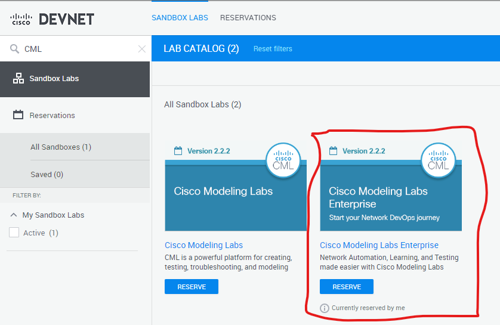

# pyats_ping_tests
A connectivity test starter kit for pyATS

## Installation

### Create virtual environment
```console
$ python3 -m venv ping_test
$ source ping_test/bin/activate
(ping_test) $
```

### Install prerequisites
```console
(ping_test) $ pip install pyats[full]
(ping_test) $ pip install tabulate
```

### Clone the repo
``` console
(ping_test) $ git clone https://github.com/automateyournetwork/pyats_ping_tests.git
(ping_test) $ cd pyats_ping_tests
(ping_test) pyats_ping_tests $ 
```

### Reserve Cisco DevNet CML Sandbox

https://devnetsandbox.cisco.com/RM/Diagram/Index/45100600-b413-4471-b28e-b014eb824555?diagramType=Topology

### Connect to VPN 
### Wait for CML to fully initialize 

## Enable CDP on all devices and interfaces
```console
ssh 10.10.20.175
login as: cisco
cisco@10.10.20.175's password: cisco
dist-rtr01# conf t
dist-rtr01(config)# cdp run
dist-rtr01(config)# int range gi1-6
dist-rtr01(config-if-range)# cdp enable

ssh 10.10.20.176
login as: cisco
cisco@10.10.20.176's password: cisco
dist-rtr02# conf t
dist-rtr02(config)# cdp run
dist-rtr02(config)# int range gi1-6
dist-rtr02(config-if-range)# cdp enable

ssh 10.10.20.177
login as: cisco
password: cisco
dist-sw01# conf t
dist-sw01(config)# cdp enable
dist-sw01(config)# int eth1/3-4
dist-sw01(config-if-range)# cdp enable

ssh 10.10.20.178
login as: cisco
password: cisco
dist-sw02# conf t
dist-sw02(config)# cdp enable
dist-sw02(config)# int eth1/3-4
dist-sw02(config-if-range)# cdp enable
```

## Run the pyATS Job 
(ping_test) pyats_ping_tests $ pyats run job pyats_ping_tests_job.py

## (Optional) View the logs with the pyATS Log Viewer
(ping_test) pyats_ping_tests $ pyats logs view

## Make adjustments
You can adjust the number of pings 

```python
number_of_pings = 5
```

You can adjust the minimum, maximum, and average millisecond response times

```python
ping_min_ms_threshold = 5
ping_max_ms_threshold = 10
ping_avg_ms_threshold = 7
```
